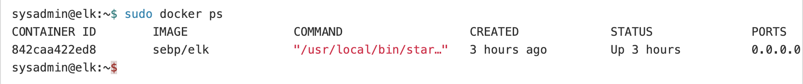

# Bootcampbasics

## Automated ELK Stack Deployment

The files in this repository were used to configure the network depicted below.

https://github.com/niccihode/Bootcampbasics/blob/main/Diagrams/Azure_Project.pdf

These files have been tested and used to generate a live ELK deployment on Azure. They can be used to either recreate the entire deployment pictured above. Alternatively, select portions of the Azure_Project.pdf file may be used to install only certain pieces of it, such as Filebeat.

https://github.com/niccihode/Bootcampbasics/blob/main/Ansible/filebeat-playbook.yml

This document contains the following details:
- Description of the Topology
- Access Policies
- ELK Configuration
  - Beats in Use
  - Machines Being Monitored
- How to Use the Ansible Build

### Description of the Topology

The main purpose of this network is to expose a load-balanced and monitored instance of DVWA, the D*mn Vulnerable Web Application.

Load balancing ensures that the application will be highly reliable, in addition to restricting access to the network.
- The off-loading function of a load balancer defends a network against DDoS (Distributed Denial of Service) Attacks.
- The Jump Box and load balancers are the only IP's exposed to the internet (public). When using a Jump Box our other Vitual Machines do not have to be exposed to the internet (public) which adds an additional layer of security. 

Integrating an ELK server allows users to easily monitor the vulnerable VMs for changes to the _____ and system configuration.
- Filebeat monitors specified log files and locations, collects these log events and forwards them to Elasticsearch or Logstash for indexing. 
- Metricbeat takes the metrics and statistics it collects and ships them to a specified output such as Elasticsearch or Logstash. 

The configuration details of each machine may be found below.

| Name                 | Function   | IP Address | Operating System |
|----------------------|------------|------------|------------------|
| Jump-Box-Provisioner | Gateway    | 10.0.0.4   | Linux            |
| Web-1                | Web Server | 10.0.0.5   | Linux            |
| Web-2                | Web server | 10.0.0.6   | Linux            |
| Web-3                | Web server | 10.0.0.7   | Linux            |
| ELK-Server           | Monitoring | 10.1.0.4   | Linux            |          

### Access Policies

The machines on the internal network are not exposed to the public Internet. 

Only the Jump-Box-Provisioner machine can accept connections from the Internet. Access to this machine is only allowed from the following IP addresses:
- IP address of my personal computer (VPN not used, IP cannot be shared)
- ELK-Server (10.1.0.4)

Machines within the network can only be accessed by SSH (Secure Shell).
- The Jump-Box-Provisioner (10.0.0.4) was the only machine that had access to the ELK-Server VM.

A summary of the access policies in place can be found in the table below.

| Name                 | Publicly Accessible | Allowed IP Addresses |
|----------------------|---------------------|----------------------|
| Jump-Box-Provisioner | Yes                 | Private* 10.1.0.4    |
| Web-1                | No                  | 10.0.0.4 10.1.0.4    |
| Web-2                | No                  | 10.0.0.4 10.1.0.4    |                     
| Web-3                | No                  | 10.0.0.4 10.1.0.4    |
| ELK-Server           | No                  | 10.0.0.4             |

*VPN was not used and therefore IP cannot be disclosed.

### Elk Configuration

Ansible was used to automate configuration of the ELK machine. No configuration was performed manually, which is advantageous because it ensures the provisioning scripts always run identically.
- This eliminates variablity between configurations and eliminates human error.

The playbook implements the following tasks:
- The Ansible apt module installs docker.io and python3-pip
- The Ansible pip module installs docker.
- The Ansible docker-container module installs the cyberxsecurity/dvwa container.
- The systemd module ensures the docker service is restarted when the machine reboots.

The following screenshot displays the result of running `docker ps` after successfully configuring the ELK instance.

### Target Machines & Beats
This ELK server is configured to monitor the following machines:
- 10.0.0.5
- 10.0.0.6
- 10.0.0.7

We have installed the following Beats on these machines:
- Filebeats
- Metricbeats

These Beats allow us to collect the following information from each machine:
- Filebeat allows us to collect log files and locations from the Virtual Machines.
- Metricbeats periodically collects metrics from the operating system and services running on the Virtual Machine.

### Using the Playbook
In order to use the playbook, you will need to have an Ansible control node already configured. Assuming you have such a control node provisioned: 

SSH into the control node and follow the steps below:
- Copy the _____ file to _____.
- Update the _____ file to include...
- Run the playbook, and navigate to ____ to check that the installation worked as expected.

_TODO: Answer the following questions to fill in the blanks:_
- _Which file is the playbook? Where do you copy it?_
- _Which file do you update to make Ansible run the playbook on a specific machine? How do I specify which machine to install the ELK server on versus which to install Filebeat on?_
- _Which URL do you navigate to in order to check that the ELK server is running?

_As a **Bonus**, provide the specific commands the user will need to run to download the playbook, update the files, etc._
